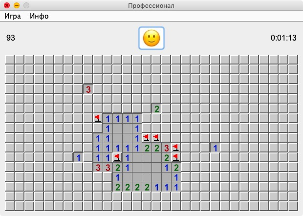
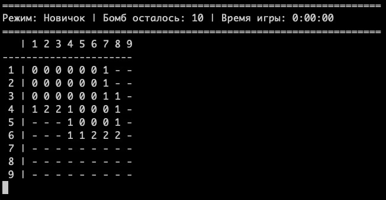
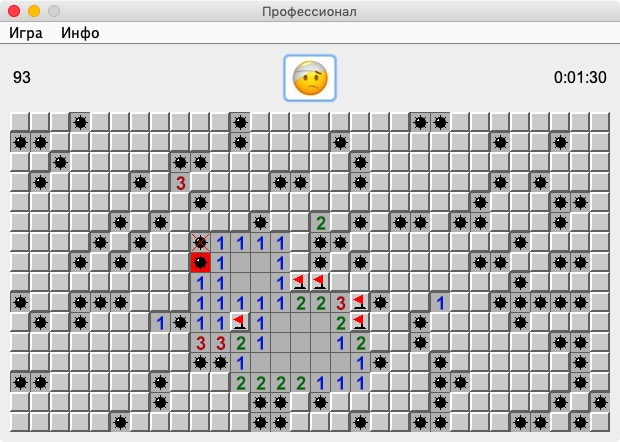
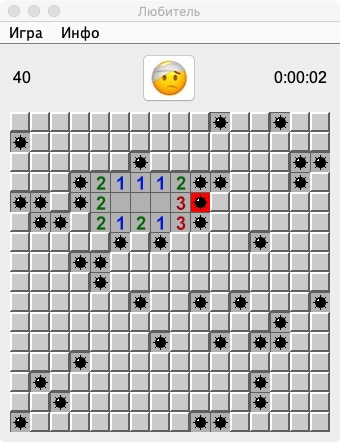
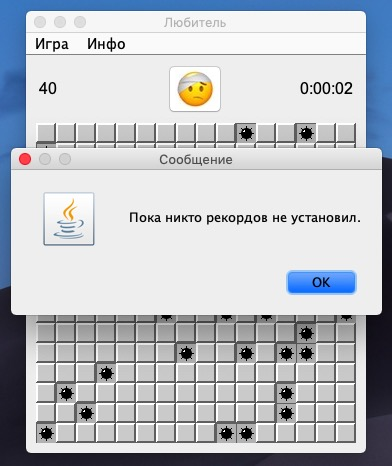

# Сапёр

Аналог классической игры из стандартной поставки ОС Windows.

### Требования
- Архитектура должна быть основана на паттерне MVC.
- Программа должна иметь два UI: текстовый и графический.
Оба интерфейса используют одну и ту же игровую модель.
- Пользователю должны быть доступны команды: Exit, About, New game, High scores.
- В текстовом UI команды вводятся из консоли, игровое поле распечатывается после каждого хода.
- В графическом UI элементы ячеек выводить с помощью картинок.
- При реализации графического интерфейса использовать библиотеку Swing.

### Реализация
Выполнено разделение программы на логические блоки в соответствии с шаблоном MVC. Выделены:
- Model: классы, хранящие в себе данные по игре. Cell, Field, режимы игры RookieMode, ProMode и т.д.
ScoreElement - класс для хранения записи в таблице рекордов.
- Controller: класс Game.
- View: два пакета gui и text с реализациями графического и текстового пользовательского интерфейса.

Из-за требования наличия текстового и графического UI для view был сделан интерфейс GameView, который реализовывают оба вида UI. 

В процессе создания игры познакомился с паттерном 'замена условного оператора полиморфизмом', пакет commands 
(в классе контроллера Game встречались очень большие блоки почти одинакового кода под switch/case).

### Ещё несколько скриншотов

